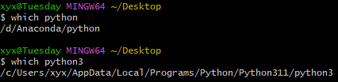

# house
## 不同版本python
### .exe文件命名
通过python文件的不同命名，实现不同版本python的管理（python.exe以及python3.exe），一般下载后默认为python.exe，在原本文件夹中生成副本重新命名为pythonx.exe即可。
```
which python
which python3
```


### 用pip给不同python环境安装package
正常：默认python.exe
```
pip install xxx
```
指定python环境
```
python3 -m pip install xxx
``````

p.s. conda的话先activate环境，再pip？
```
conda activate transformers
pip install xxx
```

## conda中的不同环境

```
# 检查conda版本
conda --version
# 查看所有环境
conda env list
# 创建新的环境
conda create -n env-name [list of package]
（1）-n env-name是设置新建环境的名字，list of package是可选项，选择要为该环境安装的包。
（2）如果我们没有指定安装python的版本，conda会安装我们最初安装conda时所装的那个版本的python。
（3）若创建特定python版本的包环境，需键入conda create -n env-name python=3.6
# 删除环境
conda remove -n [name] --all
```


